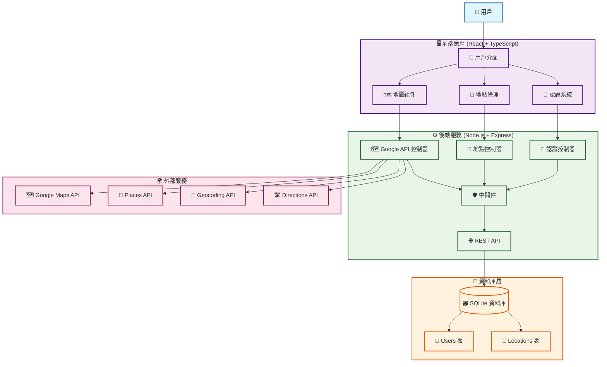

# 探探 - 地點探索與收藏平台

一個現代化的地點探索與收藏平台，整合 Google Maps API，讓使用者能夠發現、收藏和管理喜愛的店家與景點。

## 🌟 功能特色

### 🗺️ 地圖探索
- **互動式地圖**：基於 Google Maps JavaScript API 的響應式地圖
- **地點搜尋**：整合 Google Places API，支援關鍵字搜尋
- **地圖標記**：視覺化顯示收藏的地點
- **地圖點擊**：點擊地圖空白處或地標快速新增地點

### 👤 使用者系統
- **註冊/登入**：安全的 JWT 認證系統
- **個人資料**：使用者資訊管理與統計數據
- **密碼安全**：bcrypt 加密，防止密碼外洩

### 📍 地點管理
- **CRUD 操作**：新增、查看、編輯、刪除地點
- **分類系統**：餐廳、咖啡廳、景點、博物館等分類
- **評分功能**：1-5 星評分系統
- **備註功能**：個人筆記與描述
- **地址管理**：自動地理編碼與反向地理編碼

### 📱 使用者體驗
- **響應式設計**：支援桌面、平板、手機
- **多視圖模式**：列表視圖、地圖視圖、混合視圖
- **即時搜尋**：地點名稱、描述、地址搜尋
- **載入狀態**：優雅的載入動畫與錯誤處理

## 🏗️ 技術架構

### 前端技術棧
- **框架**：React 19 + TypeScript
- **建置工具**：Vite
- **UI 框架**：Material-UI (MUI) v7
- **路由管理**：React Router v7
- **狀態管理**：React Context + Custom Hooks
- **HTTP 客戶端**：Axios
- **地圖服務**：Google Maps JavaScript API
- **樣式系統**：Emotion + 設計令牌系統

### 後端技術棧
- **運行環境**：Node.js + Express
- **語言**：TypeScript
- **資料庫**：SQLite
- **認證**：JWT + bcrypt
- **API 整合**：Google Maps API (Geocoding, Places, Directions)
- **驗證**：express-validator
- **測試**：自定義測試框架

## 🏛️ 系統架構圖



## 🚀 快速開始

### 環境需求
- **Node.js** >= 16.0.0
- **npm** >= 8.0.0
- **Google Maps API Key**：
  - 前端 Browser Key (Maps JavaScript API)
  - 後端 Server Key (Geocoding API / Places API / Directions API)

### 安裝與設置

1. **複製專案**
   ```bash
   git clone <repository-url>
   cd wp1141-hw4
   ```

2. **安裝依賴**
   ```bash
   # 安裝前端依賴
   cd frontend
   npm install
   
   # 安裝後端依賴
   cd ../backend
   npm install
   ```

3. **設置環境變數**

   **後端環境變數範本** (`backend/.env.example`)：
   ```bash
   # Server Configuration
   PORT=3001
   NODE_ENV=development

   # JWT Configuration
   JWT_SECRET=your-super-secret-jwt-key-change-this-in-production
   JWT_EXPIRES_IN=7d

   # Google Maps API (Server Key - 已啟用 Geocoding/Places/Directions)
   GOOGLE_MAPS_SERVER_KEY=your-server-key-here

   # Database Configuration
   DATABASE_PATH=../database/locations.db

   # CORS Configuration
   FRONTEND_URL=http://localhost:5173
   ```
   > 對於 server key 限制類型風險，請參照 [Google Maps Server Key 安全風險](#google-maps-server-key-安全風險)

   **前端環境變數範本** (`frontend/.env.example`)：
   ```bash
   # Google Maps API (Browser Key - Maps JavaScript API)
   VITE_GOOGLE_MAPS_JS_KEY=your-browser-key-here

   # Backend API
   VITE_API_BASE_URL=http://localhost:3001
   ```

   **設置步驟**：
   - 分別複製前後端環境變數範本
      ```bash
      # backend
      cp backend/.env.example backend/.env

      # frontend
      cp frontend/.env.example frontend/.env
      ```
   - 生成 JWT Secret：
      ```bash
      # 方法 1: 使用專案工具（推薦）
      cd backend
      npm run generate-jwt
      
      # 方法 2: 使用 Node.js
      node -e "console.log(require('crypto').randomBytes(64).toString('hex'))"
      
      # 方法 3: 使用 OpenSSL
      openssl rand -hex 64
      ```
   - 填入實際值到 .env 檔案：
      ```bash
      # backend/.env
      JWT_SECRET=your-generated-secret-here
      GOOGLE_MAPS_SERVER_KEY=your-google-maps-key
      NODE_ENV=development
      PORT=3001
      ```

4. **初始化資料庫**
   ```bash
   cd backend
   npm run init-db
   ```

5. **啟動開發伺服器**
   ```bash
   # 終端機 1：啟動後端
   cd backend
   npm run dev
   
   # 終端機 2：啟動前端
   cd frontend
   npm run dev
   ```

6. **開啟應用程式**
   - 前端應用：http://localhost:5173
   - 後端 API：http://localhost:3001
   - 健康檢查：http://localhost:3001/health
   - API 配額狀態：http://localhost:3001/api/google/quota-status

## 📋 API 文件

### 認證相關 API
| 方法 | 端點 | 描述 | 認證需求 |
|------|------|------|----------|
| POST | `/api/auth/register` | 使用者註冊 | ❌ |
| POST | `/api/auth/login` | 使用者登入 | ❌ |
| POST | `/api/auth/logout` | 使用者登出 | ✅ |
| GET | `/api/auth/profile` | 取得使用者資料 | ✅ |
| PUT | `/api/auth/profile` | 更新使用者資料 | ✅ |

### 地點管理 API
| 方法 | 端點 | 描述 | 認證需求 |
|------|------|------|----------|
| GET | `/api/locations` | 取得地點清單 | ✅ |
| POST | `/api/locations` | 新增地點 | ✅ |
| GET | `/api/locations/:id` | 取得特定地點 | ✅ |
| PUT | `/api/locations/:id` | 更新地點 | ✅ |
| DELETE | `/api/locations/:id` | 刪除地點 | ✅ |
| GET | `/api/locations/stats` | 取得地點統計 | ✅ |

### Google API 整合
| 方法 | 端點 | 描述 | 認證需求 | 速率限制 |
|------|------|------|----------|----------|
| POST | `/api/google/geocode` | 地址轉座標 | ✅ | 每分鐘 10 次 |
| POST | `/api/google/reverse-geocode` | 座標轉地址 | ✅ | 每分鐘 10 次 |
| POST | `/api/google/places/nearby` | 搜尋附近地點 | ✅ | 每分鐘 10 次 |
| POST | `/api/google/places/search` | 文字搜尋地點 | ✅ | 每分鐘 10 次 |
| GET | `/api/google/places/details/:placeId` | 取得地點詳情 | ✅ | 每分鐘 10 次 |
| POST | `/api/google/directions` | 取得路線規劃 | ✅ | 每分鐘 10 次 |
| POST | `/api/google/distance-matrix` | 計算距離矩陣 | ✅ | 每分鐘 10 次 |
| GET | `/api/google/quota-status` | 查詢 API 配額狀態 | ✅ | 無限制 |

## 📡 API 使用範例

### 🔐 授權流程範例

#### 1. 使用者註冊
```bash
curl -X POST http://localhost:3001/api/auth/register \
  -H "Content-Type: application/json" \
  -d '{
    "username": "testuser",
    "email": "test@example.com",
    "password": "password123"
  }'
```

**回應範例**：
```json
{
  "success": true,
  "message": "使用者註冊成功",
  "data": {
    "user": {
      "id": 1,
      "username": "testuser",
      "email": "test@example.com"
    },
    "token": "eyJhbGciOiJIUzI1NiIsInR5cCI6IkpXVCJ9..."
  }
}
```

#### 2. 使用者登入
```bash
curl -X POST http://localhost:3001/api/auth/login \
  -H "Content-Type: application/json" \
  -d '{
    "email": "test@example.com",
    "password": "password123"
  }'
```

**回應範例**：
```json
{
  "success": true,
  "message": "登入成功",
  "data": {
    "user": {
      "id": 1,
      "username": "testuser",
      "email": "test@example.com"
    },
    "token": "eyJhbGciOiJIUzI1NiIsInR5cCI6IkpXVCJ9..."
  }
}
```

#### 3. 新增地點（需要認證）
```bash
curl -X POST http://localhost:3001/api/locations \
  -H "Content-Type: application/json" \
  -H "Authorization: Bearer YOUR_JWT_TOKEN_HERE" \
  -d '{
    "name": "台北101",
    "description": "台灣最高建築物",
    "address": "台北市信義區信義路五段7號",
    "latitude": 25.033,
    "longitude": 121.5654,
    "category": "景點",
    "rating": 5,
    "notes": "觀景台視野很棒"
  }'
```

**回應範例**：
```json
{
  "success": true,
  "message": "地點新增成功",
  "data": {
    "id": 1,
    "name": "台北101",
    "description": "台灣最高建築物",
    "address": "台北市信義區信義路五段7號",
    "latitude": 25.033,
    "longitude": 121.5654,
    "category": "景點",
    "rating": 5,
    "notes": "觀景台視野很棒",
    "userId": 1,
    "createdAt": "2024-01-15T10:30:00.000Z"
  }
}
```

#### 4. 取得地點清單（需要認證）
```bash
curl -X GET http://localhost:3001/api/locations \
  -H "Authorization: Bearer YOUR_JWT_TOKEN_HERE"
```

**回應範例**：
```json
{
  "success": true,
  "message": "地點清單取得成功",
  "data": [
    {
      "id": 1,
      "name": "台北101",
      "description": "台灣最高建築物",
      "address": "台北市信義區信義路五段7號",
      "latitude": 25.033,
      "longitude": 121.5654,
      "category": "景點",
      "rating": 5,
      "notes": "觀景台視野很棒",
      "userId": 1,
      "createdAt": "2024-01-15T10:30:00.000Z"
    }
  ]
}
```

#### 5. 地址轉座標（需要認證）
```bash
curl -X POST http://localhost:3001/api/google/geocode \
  -H "Content-Type: application/json" \
  -H "Authorization: Bearer YOUR_JWT_TOKEN_HERE" \
  -d '{
    "address": "台北市信義區信義路五段7號"
  }'
```

**回應範例**：
```json
{
  "success": true,
  "message": "地理編碼成功",
  "data": {
    "address": "台北市信義區信義路五段7號",
    "latitude": 25.033,
    "longitude": 121.5654,
    "formatted_address": "110台灣台北市信義區信義路五段7號"
  }
}
```

### 🔑 認證 Token 使用說明

**取得 Token**：
1. 先使用註冊或登入 API 取得 JWT token
2. 在後續的 API 請求中，在 Header 中加入：`Authorization: Bearer YOUR_JWT_TOKEN_HERE`
3. Token 有效期為 7 天，過期後需要重新登入

## 🔧 開發指令

### 前端開發
```bash
cd frontend

# 開發模式
npm run dev

# 建置生產版本
npm run build

# 預覽生產版本
npm run preview

# 程式碼檢查
npm run lint
```

### 後端開發
```bash
cd backend

# 開發模式 (自動重啟)
npm run dev

# 建置 TypeScript
npm run build

# 啟動生產版本
npm run start

# 初始化資料庫
npm run init-db

# JWT Secret 管理
npm run generate-jwt    # 生成新的 JWT Secret
npm run check-jwt       # 檢查 JWT Secret 強度
```

## 🔒 安全特性

### 認證安全
- **JWT Token**：安全的身份驗證
- **密碼加密**：bcrypt 雜湊加密
- **Token 驗證**：自動檢查 token 有效性
- **路由保護**：受保護的路由需要認證

### API 安全
- **速率限制**：多層級速率限制防止濫用
- **配額管理**：Google Maps API 配額保護
- **輸入驗證**：前後端雙重驗證
- **錯誤處理**：不洩露敏感資訊

### 系統安全
- **健康監控**：資料庫連接狀態監控
- **優雅關閉**：程序退出時安全清理資源
- **CORS 配置**：跨域請求安全控制
- **安全標頭**：Helmet 中間件提供安全標頭

## ⚠️ 已知問題

### 🔧 技術債務

#### 已修復問題 ✅
- **資料庫連接管理**：已修復語法錯誤，新增健康檢查和優雅關閉機制
- **API 速率限制**：已實作完整的多層級速率限制系統
- **Google Maps API 配額管理**：已建立智能配額追蹤和管理機制
- **健康檢查機制**：已增強健康檢查端點，包含資料庫狀態監控

#### 待改進問題
- **錯誤處理不完整**：部分 API 端點缺乏完整的錯誤邊界處理
- **SQLite 限制**：使用 SQLite 作為生產環境資料庫可能面臨併發和擴展性限制
- **環境變數驗證**：開發環境允許使用預設值，可能導致安全風險

#### 前端問題
- **地圖載入穩定性**：Google Maps API 載入失敗時的錯誤處理可以更優雅
- **表單驗證一致性**：部分頁面的表單驗證邏輯存在重複和不一致
- **狀態管理複雜度**：隨著功能增加，Context 狀態管理可能變得複雜
- **錯誤訊息本地化**：錯誤訊息主要為中文，缺乏國際化支援
- **性能優化**：大量地點標記時可能影響地圖渲染性能

#### 整合問題
- **API 錯誤處理**：前後端錯誤處理格式不完全統一
- **Google API 依賴**：過度依賴 Google Maps API，缺乏備用方案
- **資料同步**：前端狀態與後端資料可能存在同步延遲

### 🐛 功能限制

#### 使用者體驗
- **離線功能**：缺乏離線瀏覽和基本功能支援
- **搜尋功能**：地點搜尋僅支援基本文字搜尋，缺乏進階篩選
- **批量操作**：缺乏批量編輯、刪除地點的功能
- **資料匯出**：無法匯出地點資料為 CSV 或其他格式
- **社交功能**：缺乏地點分享、評論等社交互動功能

#### 地圖功能
- **路線規劃**：雖然整合了 Directions API，但前端未實作路線顯示
- **地圖樣式**：缺乏自定義地圖樣式和主題選擇
- **標記分類**：地圖標記缺乏視覺分類（不同類別使用不同圖標）
- **地圖快照**：無法儲存或分享地圖快照

#### 資料管理
- **資料備份**：缺乏自動資料備份機制
- **資料遷移**：缺乏資料庫版本管理和遷移工具
- **資料清理**：缺乏定期清理無效或重複資料的功能

## 🚀 未來改進方向

### 📈 短期改進（1-3個月）

#### 技術優化
- **API 標準化**：統一前後端 API 錯誤處理格式
- **性能優化**：實作地點資料分頁和虛擬滾動
- **測試覆蓋**：增加單元測試和整合測試覆蓋率
- **文檔完善**：補充 API 文檔和開發者指南

#### 功能增強
- **進階搜尋**：實作按類別、評分、距離等條件篩選
- **批量操作**：支援批量選擇、編輯、刪除地點
- **資料匯出**：實作 CSV/JSON 格式資料匯出
- **地圖優化**：實作標記分類和自定義圖標
- **離線支援**：基本的地點瀏覽離線功能

### 🎯 中期改進（3-6個月）

#### 架構升級
- **資料庫遷移**：考慮遷移到 PostgreSQL 或 MySQL
- **快取機制**：實作 Redis 快取提升 API 響應速度
- **微服務架構**：將認證、地點管理、地圖服務拆分為獨立服務
- **容器化部署**：使用 Docker 和 Kubernetes 進行容器化部署
- **CI/CD 流程**：建立自動化測試和部署流程

#### 功能擴展
- **社交功能**：實作地點分享、評論、評分系統
- **推薦系統**：基於使用者行為的地點推薦
- **多語言支援**：實作國際化和多語言介面
- **行動應用**：開發 React Native 或 Flutter 行動應用
- **管理後台**：實作管理員後台進行系統管理

#### 整合增強
- **第三方整合**：整合更多地圖服務商（OpenStreetMap、Mapbox）
- **API 擴展**：實作 GraphQL API 提供更靈活的資料查詢
- **即時通訊**：整合 WebSocket 支援即時通知
- **分析工具**：實作使用者行為分析和統計報表

### 🌟 長期願景（6個月以上）

#### 平台化發展
- **多租戶架構**：支援多個組織或企業使用
- **API 開放平台**：提供公開 API 供第三方開發者使用
- **插件系統**：實作插件架構支援功能擴展
- **雲端部署**：支援 AWS、Azure、GCP 等雲端平台部署

#### 智能化功能
- **AI 推薦**：使用機器學習提供個性化地點推薦
- **智能分類**：自動分類和標籤地點
- **語音搜尋**：支援語音輸入搜尋地點
- **AR 整合**：整合 AR 技術提供增強現實體驗

#### 生態系統建設
- **開發者社群**：建立開發者社群和插件市場
- **合作夥伴**：與旅遊、餐飲等行業建立合作關係
- **資料開放**：提供開放資料 API 促進生態發展
- **標準制定**：參與或制定地點資料標準

### 🔒 安全性改進

#### 認證安全
- **多因素認證**：實作 2FA 雙因素認證
- **OAuth 整合**：支援 Google、Facebook 等第三方登入
- **會話管理**：改進 JWT token 管理和刷新機制
- **密碼策略**：實作更嚴格的密碼複雜度要求

#### 資料安全
- **資料加密**：敏感資料加密儲存
- **API 安全**：實作 API 速率限制和 DDoS 防護
- **隱私保護**：實作 GDPR 合規的資料保護機制
- **安全審計**：定期安全漏洞掃描和修復

### 📊 監控與維護

#### 系統監控
- **性能監控**：實作 APM 應用性能監控
- **錯誤追蹤**：整合 Sentry 等錯誤追蹤服務
- **日誌管理**：建立結構化日誌和日誌分析
- **健康檢查**：實作詳細的系統健康檢查端點

#### 運維自動化
- **自動備份**：實作自動資料庫備份和恢復
- **災難恢復**：建立災難恢復和業務連續性計劃
- **容量規劃**：監控系統資源使用和容量規劃
- **版本管理**：建立資料庫版本管理和遷移流程

## 🛠️ 故障排除

### JWT Secret 相關問題

**問題 1: "缺少必要的環境變數"**
```bash
# 解決方案：生成並設定 JWT Secret
cd backend
npm run generate-jwt
# 將輸出的 JWT_SECRET 複製到 .env 檔案
```

**問題 2: "生產環境不能使用預設的 JWT secret"**
```bash
# 解決方案：生成新的安全密鑰
npm run generate-jwt
# 更新 .env 檔案中的 JWT_SECRET
```

**問題 3: JWT token 驗證失敗**
```bash
# 檢查 JWT Secret 是否正確設定
npm run check-jwt
```

**問題 4: API 速率限制過於嚴格**
```bash
# 檢查速率限制狀態
curl -I http://localhost:3001/api/locations
# 查看響應頭中的速率限制資訊
```

### Google Maps API 問題

**問題 1: "Google API 配額已用完"**
```bash
# 檢查配額狀態
curl http://localhost:3001/api/google/quota-status
```

**問題 2: 地圖無法載入**
- 檢查前端環境變數 `VITE_GOOGLE_MAPS_JS_KEY`
- 確認 Google Maps API 已啟用
- 檢查瀏覽器控制台錯誤訊息

### 資料庫問題

**問題 1: 資料庫連接失敗**
```bash
# 檢查資料庫健康狀態
curl http://localhost:3001/health
```

**問題 2: 資料庫檔案權限問題**
```bash
# 檢查資料庫檔案權限
ls -la backend/database/locations.db
# 必要時修改權限
chmod 664 backend/database/locations.db
```

## ⚠️ 安全風險說明

### Google Maps Server Key 安全風險

**風險描述**：
- **Server Key 具有較高的 API 配額限制**，且沒有瀏覽器端的安全限制
- **潛在威脅**：
  - Key 洩露時可能被惡意使用，導致 API 配額耗盡
  - 可能被用於未授權的 API 呼叫，產生額外費用
  - 缺乏 IP 限制時，任何知道 Key 的人都可以使用

**目前狀況**：
- 由於本地開發需求，暫時未設定 IP 限制
- Server Key 暴露在環境變數中，存在洩露風險

**建議措施**：
- **定期監控 API 使用量**：使用 `GET /api/google/quota-status` 端點
- **部署到生產環境時務必設定 IP 限制**
- **考慮使用環境變數管理**，避免將 Key 提交到版本控制
- **實作 API 配額警告機制**，當使用率達到 75% 和 90% 時發出警告
- **考慮使用多個 API Key**，分散風險

**JWT Secret 安全要求**：
- **長度要求**：至少 32 字元，建議 64 字元
- **隨機性**：必須使用加密安全的隨機生成器
- **唯一性**：每個環境（開發/測試/生產）使用不同的 secret
- **保密性**：絕不提交到版本控制系統
- **環境差異**：
  - 開發環境：允許使用預設值，但建議使用安全密鑰
  - 生產環境：強制要求安全密鑰，否則程序無法啟動
- **驗證工具**：使用 `npm run check-jwt` 檢查密鑰強度

## 📞 支援

如有問題或建議，請：
- 提交 [Issue](../../issues)
- 建立 [Pull Request](../../pulls)
- 聯繫開發團隊

---

**探探** - 讓探索變得更有趣！ 🗺️✨
