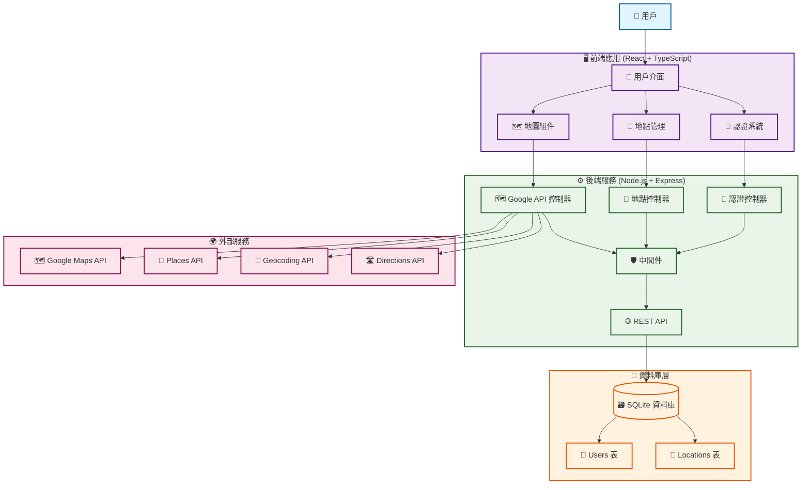

# 探探 - 地點探索與收藏平台

一個現代化的地點探索與收藏平台，整合 Google Maps API，讓使用者能夠發現、收藏和管理喜愛的店家與景點。

## 🌟 功能特色

### 🗺️ 地圖探索
- **互動式地圖**：基於 Google Maps JavaScript API 的響應式地圖
- **地點搜尋**：整合 Google Places API，支援關鍵字搜尋
- **地圖標記**：視覺化顯示收藏的地點
- **地圖點擊**：點擊地圖空白處或地標快速新增地點

### 👤 使用者系統
- **註冊/登入**：安全的 JWT 認證系統
- **個人資料**：使用者資訊管理與統計數據
- **密碼安全**：bcrypt 加密，防止密碼外洩

### 📍 地點管理
- **CRUD 操作**：新增、查看、編輯、刪除地點
- **分類系統**：餐廳、咖啡廳、景點、博物館等分類
- **評分功能**：1-5 星評分系統
- **備註功能**：個人筆記與描述
- **地址管理**：自動地理編碼與反向地理編碼

### 📱 使用者體驗
- **響應式設計**：支援桌面、平板、手機
- **多視圖模式**：列表視圖、地圖視圖、混合視圖
- **即時搜尋**：地點名稱、描述、地址搜尋
- **載入狀態**：優雅的載入動畫與錯誤處理

## 🏗️ 技術架構

### 前端技術棧
- **框架**：React 19 + TypeScript
- **建置工具**：Vite
- **UI 框架**：Material-UI (MUI) v7
- **路由管理**：React Router v7
- **狀態管理**：React Context + Custom Hooks
- **HTTP 客戶端**：Axios
- **地圖服務**：Google Maps JavaScript API
- **樣式系統**：Emotion + 設計令牌系統

### 後端技術棧
- **運行環境**：Node.js + Express
- **語言**：TypeScript
- **資料庫**：SQLite
- **認證**：JWT + bcrypt
- **API 整合**：Google Maps API (Geocoding, Places, Directions)
- **驗證**：express-validator
- **測試**：自定義測試框架

## 🏛️ 系統架構圖



### 架構說明

#### 🎯 **三層架構設計**
- **展示層 (Presentation Layer)**：React 前端應用
- **業務邏輯層 (Business Logic Layer)**：Node.js 後端服務
- **資料存取層 (Data Access Layer)**：SQLite 資料庫

#### 🔄 **資料流向**
1. **用戶操作** → 前端 UI 組件
2. **API 請求** → 後端控制器
3. **業務邏輯** → 中間件處理
4. **資料存取** → SQLite 資料庫
5. **外部整合** → Google Maps API 服務

#### 🛡️ **安全機制**
- **JWT 認證**：前後端身份驗證
- **中間件驗證**：API 請求安全檢查
- **輸入驗證**：前後端雙重驗證
- **CORS 控制**：跨域請求安全

#### 🌐 **外部服務整合**
- **Google Maps JavaScript API**：地圖顯示與互動
- **Google Places API**：地點搜尋與詳情
- **Google Geocoding API**：地址與座標轉換
- **Google Directions API**：路線規劃功能

## 📁 專案結構

```
├── frontend/                    # React 前端應用
│   ├── src/
│   │   ├── components/          # 可重用組件
│   │   │   ├── Header/         # 頭部組件群
│   │   │   ├── GoogleMap.tsx   # 地圖組件
│   │   │   └── ProtectedRoute.tsx
│   │   ├── pages/              # 頁面組件
│   │   │   ├── HomePage.tsx    # 首頁
│   │   │   ├── LoginPage.tsx   # 登入頁
│   │   │   ├── RegisterPage.tsx # 註冊頁
│   │   │   ├── ExplorePage.tsx # 探索頁
│   │   │   ├── MyLocationsPage.tsx # 我的地點
│   │   │   ├── AddLocationPage.tsx # 新增地點
│   │   │   ├── EditLocationPage.tsx # 編輯地點
│   │   │   ├── LocationDetailPage.tsx # 地點詳情
│   │   │   ├── ProfilePage.tsx # 個人資料
│   │   │   └── NotFoundPage.tsx # 404 頁面
│   │   ├── hooks/              # 自定義 Hooks
│   │   │   ├── useLocationData.ts # 地點數據管理
│   │   │   ├── useNotification.ts # 通知管理
│   │   │   ├── useSearch.ts    # 搜尋功能
│   │   │   ├── useViewMode.ts  # 視圖模式
│   │   │   └── useForm.ts      # 表單管理
│   │   ├── services/           # API 服務層
│   │   │   └── api/           # 模組化 API
│   │   │       ├── authApi.ts # 認證 API
│   │   │       ├── locationApi.ts # 地點 API
│   │   │       ├── googleApi.ts # Google API
│   │   │       └── baseClient.ts # 基礎客戶端
│   │   ├── context/           # React Context
│   │   │   └── AuthContext.tsx # 認證狀態
│   │   ├── styles/           # 樣式系統
│   │   │   ├── designTokens.ts # 設計令牌
│   │   │   └── sxUtils.ts     # 樣式工具
│   │   └── utils/            # 工具函數
│   │       ├── errorHandler.ts # 錯誤處理
│   │       ├── formValidation.ts # 表單驗證
│   │       └── googleMapsLoader.ts # 地圖載入
│   └── package.json
├── backend/                   # Node.js 後端應用
│   ├── src/
│   │   ├── controllers/      # 控制器
│   │   │   ├── authController.ts
│   │   │   ├── locationController.ts
│   │   │   └── googleApiController.ts
│   │   ├── models/           # 資料模型
│   │   │   ├── User.ts
│   │   │   ├── Location.ts
│   │   │   └── database.ts
│   │   ├── routes/           # 路由定義
│   │   │   ├── auth.ts
│   │   │   ├── location.ts
│   │   │   └── googleApi.ts
│   │   ├── services/         # 業務邏輯服務
│   │   │   ├── geocodingService.ts
│   │   │   ├── placesService.ts
│   │   │   └── directionsService.ts
│   │   ├── middleware/       # 中間件
│   │   │   ├── auth.ts
│   │   │   └── validation.ts
│   │   ├── utils/            # 工具函數
│   │   │   ├── jwt.ts
│   │   │   ├── password.ts
│   │   │   └── response.ts
│   │   └── config/           # 配置
│   │       └── index.ts
│   ├── tests/                # 測試文件
│   │   ├── integration/      # 整合測試
│   │   ├── e2e/             # 端到端測試
│   │   └── unit/            # 單元測試
│   ├── scripts/             # 腳本工具
│   │   ├── db/              # 資料庫管理
│   │   └── setup/           # 設置腳本
│   └── package.json
├── database/                # SQLite 資料庫檔案
│   └── locations.db
└── README.md
```

## 🚀 快速開始

### 環境需求
- **Node.js** >= 16.0.0
- **npm** >= 8.0.0
- **Google Maps API Key** (需要啟用以下 API)：
  - Maps JavaScript API
  - Geocoding API
  - Places API
  - Directions API

### 安裝與設置

1. **複製專案**
   ```bash
   git clone <repository-url>
   cd wp1141-hw4
   ```

2. **設置環境變數**

   **後端環境變數範本** (`backend/.env.example`)：
   ```bash
   # Server Configuration
   # Server Configuration
   PORT=3001
   NODE_ENV=development

   # JWT Configuration
   JWT_SECRET=your-super-secret-jwt-key-change-this-in-production
   JWT_EXPIRES_IN=7d

   # Google Maps API (Server Key - 已啟用 Geocoding/Places/Directions)
   GOOGLE_MAPS_SERVER_KEY=your-server-key-here

   # Database Configuration
   DATABASE_PATH=../database/locations.db

   # CORS Configuration
   FRONTEND_URL=http://localhost:5173
   ```

   **前端環境變數範本** (`frontend/.env.example`)：
   ```bash
   # Google Maps API (Browser Key - Maps JavaScript API)
   VITE_GOOGLE_MAPS_JS_KEY=your-browser-key-here

   # Backend API
   VITE_API_BASE_URL=http://localhost:3001
   ```

   **設置步驟**：
   ```bash
   # 後端：複製環境變數範本並填入實際值
   cp backend/.env.example backend/.env
   # 編輯 backend/.env 並填入你的 Google Maps Server Key

   # 前端：複製環境變數範本並填入實際值
   cp frontend/.env.example frontend/.env
   # 編輯 frontend/.env 並填入你的 Google Maps Browser Key
   ```

   **⚠️ 安全提醒**
   
   **後端 Key（Server Key）安全風險**
   
   - **風險描述**：Server Key 具有較高的 API 配額限制，且沒有瀏覽器端的安全限制
   - **潛在威脅**：
     - Key 洩露時可能被惡意使用，導致 API 配額耗盡
     - 可能被用於未授權的 API 呼叫，產生額外費用
     - 缺乏 IP 限制時，任何知道 Key 的人都可以使用
   - **目前狀況**：由於本地開發需求，暫時未設定 IP 限制
   - **建議措施**：
     - 定期監控 API 使用量
     - 部署到生產環境時務必設定 IP 限制
     - 考慮使用環境變數管理，避免將 Key 提交到版本控制

3. **安裝依賴**
   ```bash
   # 安裝前端依賴
   cd frontend
   npm install
   
   # 安裝後端依賴
   cd ../backend
   npm install
   ```

4. **初始化資料庫**
   ```bash
   cd backend
   npm run init-db
   ```

5. **啟動開發伺服器**
   ```bash
   # 終端機 1：啟動後端
   cd backend
   npm run dev
   
   # 終端機 2：啟動前端
   cd frontend
   npm run dev
   ```

6. **開啟應用程式**
   - 前端應用：http://localhost:5173
   - 後端 API：http://localhost:3001

## 📋 API 文件

### 認證相關 API
| 方法 | 端點 | 描述 | 認證需求 |
|------|------|------|----------|
| POST | `/api/auth/register` | 使用者註冊 | ❌ |
| POST | `/api/auth/login` | 使用者登入 | ❌ |
| POST | `/api/auth/logout` | 使用者登出 | ✅ |
| GET | `/api/auth/profile` | 取得使用者資料 | ✅ |
| PUT | `/api/auth/profile` | 更新使用者資料 | ✅ |

### 地點管理 API
| 方法 | 端點 | 描述 | 認證需求 |
|------|------|------|----------|
| GET | `/api/locations` | 取得地點清單 | ✅ |
| POST | `/api/locations` | 新增地點 | ✅ |
| GET | `/api/locations/:id` | 取得特定地點 | ✅ |
| PUT | `/api/locations/:id` | 更新地點 | ✅ |
| DELETE | `/api/locations/:id` | 刪除地點 | ✅ |
| GET | `/api/locations/stats` | 取得地點統計 | ✅ |

### Google API 整合
| 方法 | 端點 | 描述 | 認證需求 |
|------|------|------|----------|
| POST | `/api/google/geocode` | 地址轉座標 | ✅ |
| POST | `/api/google/reverse-geocode` | 座標轉地址 | ✅ |
| POST | `/api/google/places/search` | 搜尋附近地點 | ✅ |
| GET | `/api/google/places/details/:placeId` | 取得地點詳情 | ✅ |
| POST | `/api/google/directions` | 取得路線規劃 | ✅ |
| POST | `/api/google/distance-matrix` | 計算距離矩陣 | ✅ |

## 📡 API 使用範例

### 🔐 授權流程範例

#### 1. 使用者註冊
```bash
curl -X POST http://localhost:3001/api/auth/register \
  -H "Content-Type: application/json" \
  -d '{
    "username": "testuser",
    "email": "test@example.com",
    "password": "password123"
  }'
```

**回應範例**：
```json
{
  "success": true,
  "message": "使用者註冊成功",
  "data": {
    "user": {
      "id": 1,
      "username": "testuser",
      "email": "test@example.com"
    },
    "token": "eyJhbGciOiJIUzI1NiIsInR5cCI6IkpXVCJ9..."
  }
}
```

#### 2. 使用者登入
```bash
curl -X POST http://localhost:3001/api/auth/login \
  -H "Content-Type: application/json" \
  -d '{
    "email": "test@example.com",
    "password": "password123"
  }'
```

**回應範例**：
```json
{
  "success": true,
  "message": "登入成功",
  "data": {
    "user": {
      "id": 1,
      "username": "testuser",
      "email": "test@example.com"
    },
    "token": "eyJhbGciOiJIUzI1NiIsInR5cCI6IkpXVCJ9..."
  }
}
```

### 📍 地點管理範例

#### 3. 新增地點（需要認證）
```bash
curl -X POST http://localhost:3001/api/locations \
  -H "Content-Type: application/json" \
  -H "Authorization: Bearer YOUR_JWT_TOKEN_HERE" \
  -d '{
    "name": "台北101",
    "description": "台灣最高建築物",
    "address": "台北市信義區信義路五段7號",
    "latitude": 25.033,
    "longitude": 121.5654,
    "category": "景點",
    "rating": 5,
    "notes": "觀景台視野很棒"
  }'
```

**回應範例**：
```json
{
  "success": true,
  "message": "地點新增成功",
  "data": {
    "id": 1,
    "name": "台北101",
    "description": "台灣最高建築物",
    "address": "台北市信義區信義路五段7號",
    "latitude": 25.033,
    "longitude": 121.5654,
    "category": "景點",
    "rating": 5,
    "notes": "觀景台視野很棒",
    "userId": 1,
    "createdAt": "2024-01-15T10:30:00.000Z"
  }
}
```

#### 4. 取得地點清單（需要認證）
```bash
curl -X GET http://localhost:3001/api/locations \
  -H "Authorization: Bearer YOUR_JWT_TOKEN_HERE"
```

**回應範例**：
```json
{
  "success": true,
  "message": "地點清單取得成功",
  "data": [
    {
      "id": 1,
      "name": "台北101",
      "description": "台灣最高建築物",
      "address": "台北市信義區信義路五段7號",
      "latitude": 25.033,
      "longitude": 121.5654,
      "category": "景點",
      "rating": 5,
      "notes": "觀景台視野很棒",
      "userId": 1,
      "createdAt": "2024-01-15T10:30:00.000Z"
    }
  ]
}
```

### 🗺️ Google API 整合範例

#### 5. 地址轉座標（需要認證）
```bash
curl -X POST http://localhost:3001/api/google/geocode \
  -H "Content-Type: application/json" \
  -H "Authorization: Bearer YOUR_JWT_TOKEN_HERE" \
  -d '{
    "address": "台北市信義區信義路五段7號"
  }'
```

**回應範例**：
```json
{
  "success": true,
  "message": "地理編碼成功",
  "data": {
    "address": "台北市信義區信義路五段7號",
    "latitude": 25.033,
    "longitude": 121.5654,
    "formatted_address": "110台灣台北市信義區信義路五段7號"
  }
}
```

#### 6. 搜尋附近地點（需要認證）
```bash
curl -X POST http://localhost:3001/api/google/places/search \
  -H "Content-Type: application/json" \
  -H "Authorization: Bearer YOUR_JWT_TOKEN_HERE" \
  -d '{
    "query": "星巴克",
    "location": {
      "lat": 25.033,
      "lng": 121.5654
    },
    "radius": 1000
  }'
```

**回應範例**：
```json
{
  "success": true,
  "message": "地點搜尋成功",
  "data": {
    "places": [
      {
        "place_id": "ChIJ...",
        "name": "星巴克 台北101店",
        "formatted_address": "台北市信義區信義路五段7號",
        "geometry": {
          "location": {
            "lat": 25.033,
            "lng": 121.5654
          }
        },
        "rating": 4.2,
        "types": ["cafe", "food", "point_of_interest"]
      }
    ]
  }
}
```

#### 7. 更新地點（需要認證）
```bash
curl -X PUT http://localhost:3001/api/locations/1 \
  -H "Content-Type: application/json" \
  -H "Authorization: Bearer YOUR_JWT_TOKEN_HERE" \
  -d '{
    "name": "台北101觀景台",
    "description": "台灣最高建築物觀景台",
    "rating": 5,
    "notes": "夜景很美，值得一遊"
  }'
```

**回應範例**：
```json
{
  "success": true,
  "message": "地點更新成功",
  "data": {
    "id": 1,
    "name": "台北101觀景台",
    "description": "台灣最高建築物觀景台",
    "address": "台北市信義區信義路五段7號",
    "latitude": 25.033,
    "longitude": 121.5654,
    "category": "景點",
    "rating": 5,
    "notes": "夜景很美，值得一遊",
    "userId": 1,
    "updatedAt": "2024-01-15T11:00:00.000Z"
  }
}
```

### 🔑 認證 Token 使用說明

**取得 Token**：
1. 先使用註冊或登入 API 取得 JWT token
2. 在後續的 API 請求中，在 Header 中加入：`Authorization: Bearer YOUR_JWT_TOKEN_HERE`
3. Token 有效期為 7 天，過期後需要重新登入

**錯誤處理範例**：
```bash
# 未提供認證 token 的錯誤回應
curl -X GET http://localhost:3001/api/locations
```

**錯誤回應**：
```json
{
  "success": false,
  "message": "未提供認證 token",
  "error": "UNAUTHORIZED"
}
```

## 🔧 開發指令

### 前端開發
```bash
cd frontend

# 開發模式
npm run dev

# 建置生產版本
npm run build

# 預覽生產版本
npm run preview

# 程式碼檢查
npm run lint
```

### 後端開發
```bash
cd backend

# 開發模式 (自動重啟)
npm run dev

# 建置 TypeScript
npm run build

# 啟動生產版本
npm run start

# 初始化資料庫
npm run init-db
```

### 測試指令
```bash
cd backend

# 執行所有測試
npm run test:all

# 執行單一測試
npm run test:single

# 測試特定功能
npm run test-auth      # 認證測試
npm run test-location  # 地點 CRUD 測試
npm run test-google    # Google API 測試
npm run test-geocoding # 地理編碼測試
```

### 資料庫管理
```bash
cd backend

# 清除所有資料
npm run db:clear

# 重建資料庫
npm run db:rebuild

# 查看資料庫資訊
npm run db:info
```

## 🎨 設計系統

### 設計令牌
專案使用統一的設計令牌系統，定義在 `frontend/src/styles/designTokens.ts`：

- **顏色系統**：主色調、次色調、語義色彩
- **字體系統**：字體家族、大小、權重
- **間距系統**：統一的間距規範
- **邊框半徑**：統一的圓角規範
- **陰影系統**：分層的陰影效果

### 樣式工具
`frontend/src/styles/sxUtils.ts` 提供常用的樣式工具：

- **響應式樣式**：適配不同螢幕尺寸
- **常用樣式**：按鈕、佈局、文字樣式
- **主題整合**：與 Material-UI 主題系統整合

## 🧪 測試策略

### 測試類型
- **單元測試**：測試個別函數和組件
- **整合測試**：測試 API 端點和資料庫操作
- **端到端測試**：測試完整的用戶流程

### 測試覆蓋範圍
- ✅ 認證流程 (註冊、登入、登出)
- ✅ 地點 CRUD 操作
- ✅ Google API 整合
- ✅ 資料庫操作
- ✅ 表單驗證
- ✅ 錯誤處理

## 🔒 安全特性

### 認證安全
- **JWT Token**：安全的身份驗證
- **密碼加密**：bcrypt 雜湊加密
- **Token 驗證**：自動檢查 token 有效性
- **路由保護**：受保護的路由需要認證

### 資料安全
- **輸入驗證**：前後端雙重驗證
- **SQL 注入防護**：參數化查詢
- **CORS 配置**：跨域請求安全控制
- **錯誤處理**：不洩露敏感資訊

## 📱 響應式設計

### 斷點系統
- **手機**：< 600px
- **平板**：600px - 960px
- **桌面**：> 960px

### 適配特性
- **彈性佈局**：Flexbox 和 Grid 佈局
- **響應式圖片**：適配不同螢幕密度
- **觸控友好**：優化觸控操作體驗
- **地圖適配**：地圖組件響應式調整

## 🚀 部署指南

### 生產環境設置
1. **環境變數配置**
2. **資料庫遷移**
3. **靜態資源優化**
4. **API 速率限制**
5. **錯誤監控設置**

### 性能優化
- **代碼分割**：按需載入組件
- **圖片優化**：壓縮和延遲載入
- **快取策略**：API 響應快取
- **CDN 整合**：靜態資源 CDN

## 🤝 貢獻指南

### 開發流程
1. Fork 專案
2. 建立功能分支
3. 提交變更
4. 建立 Pull Request

### 代碼規範
- **TypeScript**：嚴格的類型檢查
- **ESLint**：代碼品質檢查
- **Prettier**：代碼格式化
- **Git Hooks**：提交前檢查

## 📄 授權

MIT License - 詳見 [LICENSE](LICENSE) 檔案

## 📞 支援

如有問題或建議，請：
- 提交 [Issue](../../issues)
- 建立 [Pull Request](../../pulls)
- 聯繫開發團隊

---

**探探** - 讓探索變得更有趣！ 🗺️✨
